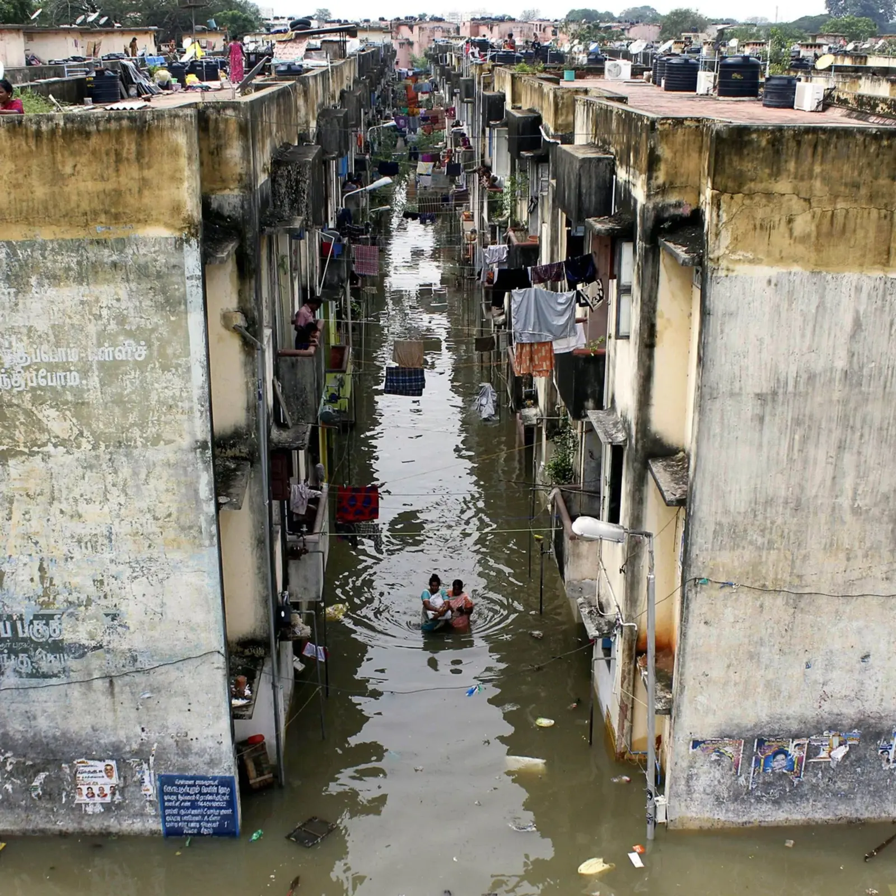

# Severed Accessibility and Urban Resilience: Flood Risk in Chennai, India

**BARC0026: Analytical Design Research Project Coursework** | MSc in Space Syntax: Architecture and Cities | The Bartlett School of Architecture, UCL | 2021

**Author:** Daniela Reséndiz García  
**Supervisor:** Prof. Alan Penn

---

## Abstract

This study introduces a spatial methodology that models accessibility loss under extreme flood conditions, integrating a 100-year return period scenario with network-based spatial analysis. Applied to Chennai, India, the approach overlays flood impact on road networks, land use, and infrastructure to assess where functional accessibility collapses. A clustering analysis further identifies priority zones for safe shelter allocation and evacuation planning.

<p align="center">
  
</p>

## Methodology (overview)

<p align="center">
  
</p>

Vector PDF (rendered from LaTeX/TikZ): [`docs/diagrams/methodology_framework_chennai.pdf`](docs/diagrams/methodology_framework_chennai.pdf). Source: [`docs/diagrams/methodology_framework_chennai_diagram.tex`](docs/diagrams/methodology_framework_chennai_diagram.tex).

The analysis is structured across four stages:

| Stage | Methods | Key outputs |
|------:|---------|-------------|
| **1** | Flood overlay on street network (100-year return; penalties + deletions) | Flood-conditioned street network (r3000 / r800) |
| **2** | Exposure overlays (land use, health, education, slums, shelters) | Risk classification by system/service |
| **3** | Global-scale resilience modelling (population density + critical infra + NACHr3000) | Priority emergency corridors + WSUD intervention zones |
| **4** | Local-scale resilience modelling (NAINr800/NAINr3000 + clustering) | Safe zones + shelter/boat deployment assessment |

### Study Area

- **Adyar River basin**, Chennai, Tamil Nadu, India

### Key Data Sources

- Street network + base layers (OpenStreetMap / GIS basemaps)
- 100-year return period flood model (OpenCity Data)
- DEM (Copernicus GLO-30) + waterways (India Water Resources Information System)
- Buildings (Google Open Buildings) and critical facilities (e.g., GCC datasets)
- Remote sensing / imagery used for interpretation and mapping export (QGIS)

## Data (overview)

**For complete data sources and download instructions, see [`DATA_SOURCES.md`](DATA_SOURCES.md).**

Large datasets are hosted on Google Drive (GitHub size limits):
- **Google Drive folder (public):** https://drive.google.com/open?id=1cVT_UkIAJWT-I-wsGkITIKPlJPdiMdUH&usp=drive_fs

Recommended Drive structure:

| Folder | Contents |
|--------|----------|
| `network/` | OSM roads, segment analysis outputs (DepthmapX/QGIS) |
| `flood/` | Flood extent / return period layers |
| `land_use/` | Land-use / land-cover layers |
| `shelters_services/` | Shelter locations + critical services (health/education/slums) |
| `boundaries/` | Admin boundaries / study area polygon |
| `exports/` | Final merged layers used for QGIS map export |

Local data location (author machine; not in repo): `/Users/danielaresendiz/Library/CloudStorage/OneDrive-UniversityCollegeLondon(2)/SSMAD_2/Project`

## Paper (PDF + LaTeX)

- Final submission PDF: [`papers/210525_ADRP_DanielaResendiz.pdf`](papers/210525_ADRP_DanielaResendiz.pdf)
- Appendix: [`papers/Appendix_A_Methods.pdf`](papers/Appendix_A_Methods.pdf)
- LaTeX source: [`latex/`](latex/) (compiled output: [`papers/ADRP_Chennai_2021_Resendiz.pdf`](papers/ADRP_Chennai_2021_Resendiz.pdf))

To compile locally:
- `cd latex && latexmk -pdf`

## Results

### Accessibility under normal vs flood conditions

<p align="center">
  
</p>

### Population density, accessibility, and safe zones

<p align="center">
  
</p>

### Shelter evaluation and priority interventions

<p align="center">
  
  
</p>

Full map atlas (QGIS export): [`figures/chennai_maps.pdf`](figures/chennai_maps.pdf).

## Research Questions

1. How do floods reshape the spatial accessibility of urban street networks?
2. How does the reconfigured urban structure affect critical systems such as health services, education, land use, slums, and shelters?
3. How can resilience be improved at both global and local scales by strategically enhancing accessibility to critical services during flood events?

## Key Findings

1. **Accessibility degradation is spatially uneven.** Compact urban forms retain greater connectivity under stress, while dispersed or fragmented areas become structurally isolated.
2. **Resilience is reframed** not as physical resistance to flooding, but as the preservation of spatial connection under disruption.
3. **Priority corridors and zones** can be derived by intersecting flood exposure, accessibility loss, and critical service locations.

## Repository Structure

```
flood-accessibility-chennai/
├── README.md
├── DATA_SOURCES.md
├── LICENSE
├── .gitignore
│
├── code/                      # Minimal scripts / processing notes
├── data/                      # Sample data + access docs
├── docs/                      # Diagrams (LaTeX + PDF/SVG)
├── figures/                   # Maps and result visualisations
├── latex/                     # LaTeX paper source
└── papers/                    # Output PDF(s)
```

## Workflow Overview

The project follows a four-stage pipeline:

1. **Stage 1 (Network reconfiguration):** apply flood penalties/removals to the street network (r3000 / r800).
2. **Stage 2 (Exposure overlays):** intersect accessibility loss with land use, services, slums, shelters.
3. **Stage 3 (Global strategies):** derive emergency corridors and WSUD zones from NACHr3000 + DEM/waterways.
4. **Stage 4 (Local strategies):** identify safe clusters and evaluate shelter/boat placement under flood conditions.

## Scripts (minimal)

This project is primarily a GIS + Space Syntax workflow (DepthmapX + QGIS). A few small Python helpers used for the flood-model inputs and checks live in [`code/python/`](code/python/) (see README in that folder).

## Software and Tools

- **DepthmapX** - Space Syntax segment angular analysis
- **QGIS** - GIS overlay, mapping, export
- **OpenStreetMap** - Street network data

## Citation

If you use this work, please cite:

```
Resendiz Garcia, D. (2021). Street Network and Blue-Green Infrastructure for Flood Resilience:
Chennai, India. MSc in Space Syntax: Architecture and Cities, The Bartlett School of Architecture, UCL.
```

## License

This project is licensed under the MIT License - see the [LICENSE](LICENSE) file for details.

## Contact

Daniela Resendiz Garcia - [GitHub](https://github.com/danielaresendizg)
