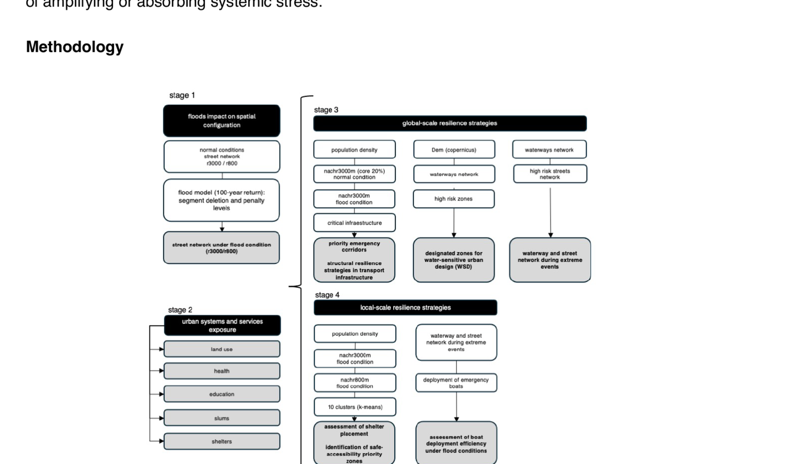

# Severed Accessibility and Urban Resilience: Flood Risk in Chennai, India

**Adaptive Design and Research Paper** | MSc Urban Development Planning | UCL The Bartlett | 2021

**Author:** Daniela Resendiz Garcia

---

## Abstract

This study introduces a spatial methodology that models accessibility loss under extreme flood conditions, integrating a 100-year return period scenario with network-based spatial analysis. Applied to Chennai, India, the approach overlays flood impact on road networks, land use, and infrastructure to assess where functional accessibility collapses. A clustering analysis further identifies priority zones for safe shelter allocation and evacuation planning.

<p align="center">
  
</p>

## Key Results (maps)

### Accessibility under normal vs flood conditions

<p align="center">
  
</p>

### Population density, accessibility, and safe zones

<p align="center">
  
</p>

### Shelter evaluation and priority interventions

<p align="center">
  
  
</p>

Full map atlas: [`figures/chennai_maps.pdf`](figures/chennai_maps.pdf).

## Research Questions

1. How does street network configuration influence flood vulnerability?
2. What role can blue-green infrastructure play in enhancing flood resilience?
3. How can Space Syntax analysis inform flood-resilient urban design?

## Key Findings

- **Accessibility degradation is spatially uneven.** Compact urban forms retain greater connectivity under stress, while dispersed or fragmented areas become structurally isolated.
- **Resilience is reframed** not as physical resistance to flooding, but as the preservation of spatial connection under disruption.
- **Priority corridors and zones** can be derived by intersecting flood exposure, accessibility loss, and critical service locations.

## Methodology (overview)

<p align="center">
  
</p>

| Step | Method | Tools |
|------|--------|-------|
| Network analysis | Space Syntax (NAIN, NACH) at multiple radii | DepthmapX, QGIS |
| Flood modelling | 100-year return period overlay on road network | GIS overlay analysis |
| Vulnerability mapping | Land use + flood extent + infrastructure access | QGIS, satellite imagery |
| Clustering | Priority zone identification for shelter/evacuation | Spatial statistics |
| Blue-green infrastructure | WSUD-based design strategies | Design analysis |

### Study Area

- **Adyar River basin**, Chennai, Tamil Nadu, India

### Data Sources (high level)

- OpenStreetMap for street network data
- Land use maps from the Chennai Metropolitan Development Authority
- Flood inundation maps (2015 Chennai floods, 100-year return scenario)
- Satellite imagery (Google Earth, Sentinel-2)

## Paper (LaTeX)

Final submission PDF: [`papers/210525_ADRP_DanielaResendiz.pdf`](papers/210525_ADRP_DanielaResendiz.pdf) (+ [`papers/Appendix_A_Methods.pdf`](papers/Appendix_A_Methods.pdf)).

The paper source lives in [`latex/`](latex/). (LaTeX scaffold PDF: [`papers/ADRP_Chennai_2021_Resendiz.pdf`](papers/ADRP_Chennai_2021_Resendiz.pdf).)

## Data Access

Large datasets are hosted on Google Drive (GitHub size limits). See [`DATA_SOURCES.md`](DATA_SOURCES.md) for a checklist and where to plug your shared folder link.

## Repository Structure

```
flood-accessibility-chennai/
├── README.md
├── DATA_SOURCES.md
├── LICENSE
├── .gitignore
│
├── code/                      # Minimal scripts / processing notes
├── data/                      # Sample data + access docs
├── docs/                      # Optional project page / diagrams
├── figures/                   # Maps and result visualisations
├── latex/                     # LaTeX paper source
└── papers/                    # Output PDF(s)
```

## Software and Tools

- **DepthmapX** - Space Syntax segment angular analysis
- **QGIS** - GIS overlay, mapping, export
- **OpenStreetMap** - Street network data

## Citation

If you use this work, please cite:

```
Resendiz Garcia, D. (2021). Street Network and Blue-Green Infrastructure for Flood Resilience:
Chennai, India. MSc Urban Development Planning, UCL The Bartlett.
```

## License

This project is licensed under the MIT License - see the [LICENSE](LICENSE) file for details.

## Contact

Daniela Resendiz Garcia - [GitHub](https://github.com/danielaresendizg)
