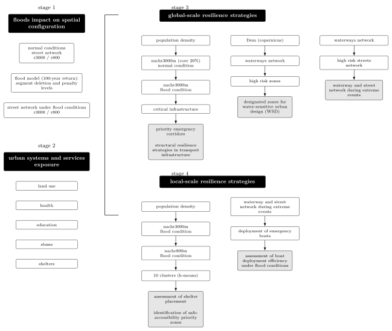
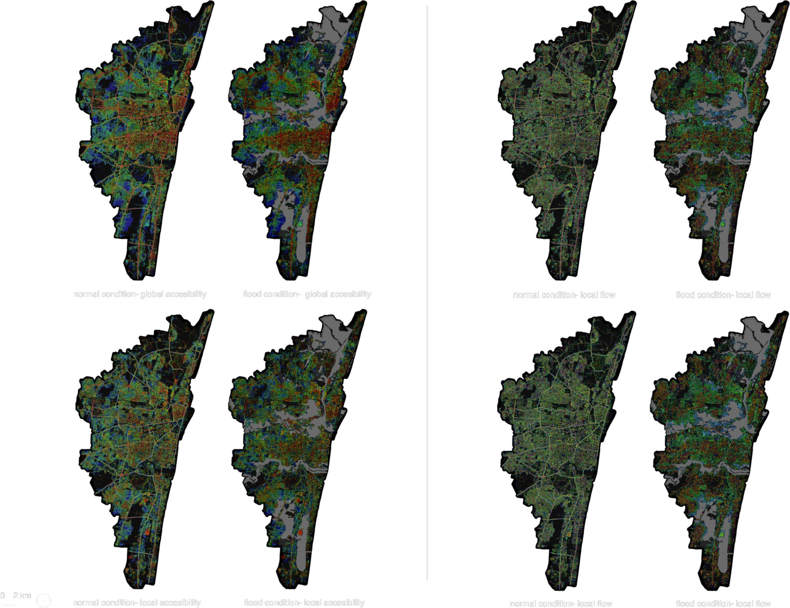
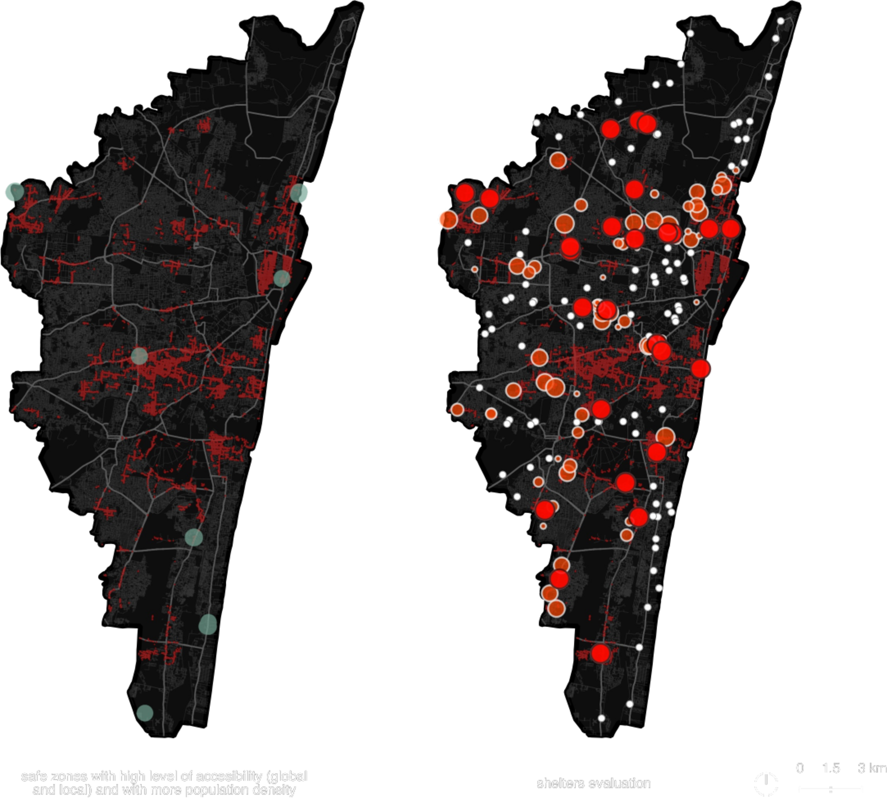
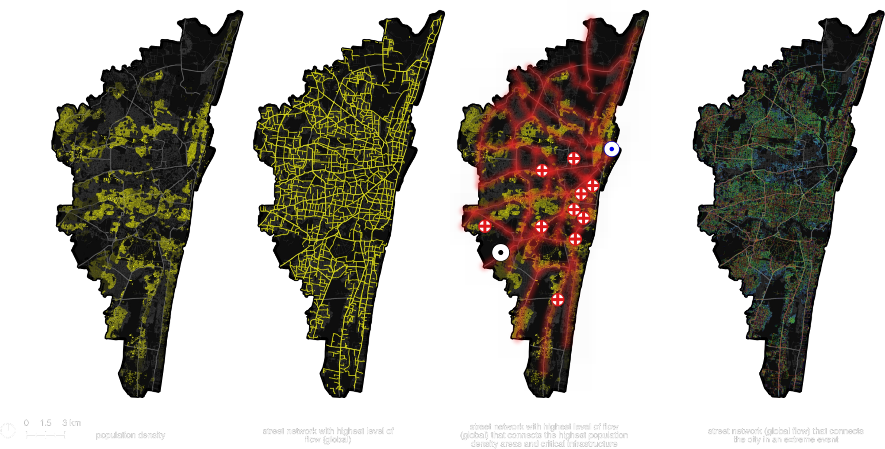

# Severed Accessibility and Urban Resilience: Flood Risk in Chennai, India

**BARC0026: Analytical Design Research Project Coursework** | MSc in Space Syntax: Architecture and Cities | The Bartlett School of Architecture, UCL | 2025

**Author:** Daniela Resendiz Garcia
**Supervisor:** Prof. Alan Penn

---

## Abstract

Flooding is a rapidly intensifying urban challenge, disrupting essential services and exposing structural inequalities across cities worldwide. While existing frameworks address either ecological resilience or spatial configuration, few capture how flood events dynamically alter accessibility—disconnecting populations from shelters, services, or safe mobility routes.

This study introduces a spatial methodology that models accessibility loss under extreme flood conditions, integrating a 100-year return period scenario with network-based spatial analysis. Applied to Chennai, India, the approach overlays flood impact on road networks, land use, and infrastructure to assess where functional accessibility collapses. A clustering analysis further identifies priority zones for safe shelter allocation and evacuation planning.

Results show that accessibility degradation is spatially uneven. Compact urban forms retain greater connectivity under stress, while dispersed or fragmented areas become structurally isolated. Key corridors and intervention areas are mapped both at local and metropolitan scales, offering actionable entry points for adaptive planning.

The method reframes resilience not as physical resistance to flooding, but as the preservation of spatial connection under disruption. It is transferable to diverse urban contexts and leverages open-access spatial and environmental data, enabling scalable diagnostics without relying on intensive modelling or proprietary inputs.

## Methodology (overview)

<p align="center">
  
</p>

Vector PDF (rendered from LaTeX/TikZ): [`docs/diagrams/methodology_framework_chennai.pdf`](docs/diagrams/methodology_framework_chennai.pdf). Source: [`docs/diagrams/methodology_framework_chennai_diagram.tex`](docs/diagrams/methodology_framework_chennai_diagram.tex).

The analysis is structured across four stages:

| Stage | Methods | Key outputs |
|------:|---------|-------------|
| **1** | Flood overlay on street network (100-year return; penalties + deletions) | Flood-conditioned street network (r3000 / r800) |
| **2** | Exposure overlays (land use, health, education, slums, shelters) | Risk classification by system/service |
| **3** | Global-scale resilience modelling (population density + critical infra + NACHr3000) | Priority emergency corridors + WSUD intervention zones |
| **4** | Local-scale resilience modelling (NAINr800/NAINr3000 + clustering) | Safe zones + shelter/boat deployment assessment |

### Study Area

- **Adyar River basin**, Chennai, Tamil Nadu, India
- **Geographic extent:** Coastal megacity spanning 328 km² (2006), with rapidly expanding informal settlements in flood-prone areas
- **Urban vulnerability context:** Colonial urban grid transitioning to sprawling metropolitan form; interconnected waterway systems degraded to impermeable, fragmented landscapes

### Key Data Sources

- **Spatial network:** OpenStreetMap street network (segment-level analysis)
- **Flood hazard:** 100-year return period model (OpenCity Data)
- **Elevation & hydrology:** Copernicus GLO-30 DEM + India Water Resources Information System
- **Urban morphology:** Google Open Buildings + census data
- **Infrastructure & services:** GCC datasets (shelters, health, education, slums)
- **Analysis & visualization:** Space Syntax (DepthmapX), QGIS, remote sensing interpretation

## Data (overview)

**For complete data sources and download instructions, see [DATA_SOURCES.md](DATA_SOURCES.md).**

All large datasets are hosted on Google Drive due to GitHub size limitations:
- **[Download Project Data](https://drive.google.com/open?id=1cVT_UkIAJWT-I-wsGkITIKPlJPdiMdUH&usp=drive_fs)** (Google Drive, public access)

| Folder | Size | Contents |
|--------|------|----------|
| `network/` | ~150 MB | OSM roads, segment analysis outputs (DepthmapX/QGIS) |
| `flood/` | ~200 MB | Flood extent / return period layers (100-year scenario) |
| `land_use/` | ~100 MB | Land-use / land-cover classification |
| `shelters_services/` | ~50 MB | Shelter locations + critical services (health/education/slums) |
| `boundaries/` | ~10 MB | Admin boundaries / study area polygon |
| `exports/` | ~300 MB | Final merged layers + QGIS map exports |

**Total:** ~800 MB on Google Drive

Local data location (author machine; not in repo):
`/Users/danielaresendiz/Library/CloudStorage/OneDrive-UniversityCollegeLondon(2)/SSMAD_2/Project`

## Paper (PDF + LaTeX)

**Final Submissions:**
- [`papers/210525_ADRP_DanielaResendiz.pdf`](papers/210525_ADRP_DanielaResendiz.pdf) - Final coursework submission (25 pages)
- [`papers/Appendix_A_Methods.pdf`](papers/Appendix_A_Methods.pdf) - Supplementary methods appendix

**Repository Build:**
- [`papers/ADRP_Chennai_2021_Resendiz.pdf`](papers/ADRP_Chennai_2021_Resendiz.pdf) - LaTeX scaffold (not original layout; for reference)
- **Source:** [`latex/`](latex/) directory

**To compile locally:**
```bash
cd latex && latexmk -pdf
```

**LaTeX Structure:**
- `main.tex` - Main document with section includes
- `sections/` - Individual sections (introduction, methods, results, discussion, conclusion)
- `references.bib` - Bibliography database

## Results

### Accessibility under normal vs flood conditions

<p align="center">
  
</p>

### Population density, accessibility, and safe zones

<p align="center">
  
</p>

### Shelter evaluation and priority interventions

<p align="center">
  
  
</p>

Full map atlas (QGIS export): [`figures/chennai_maps.pdf`](figures/chennai_maps.pdf).

## Research Questions

1. How do floods reshape the spatial accessibility of urban street networks?
2. How does the reconfigured urban structure affect critical systems such as health services, education, land use, slums, and shelters?
3. How can resilience be improved at both global and local scales by strategically enhancing accessibility to critical services during flood events?

## Key Findings

1. **Accessibility degradation is spatially uneven.** Compact urban forms retain greater connectivity under stress, while dispersed or fragmented areas become structurally isolated.
2. **Resilience is reframed** not as physical resistance to flooding, but as the preservation of spatial connection under disruption.
3. **Priority corridors and zones** can be derived by intersecting flood exposure, accessibility loss, and critical service locations.

## Repository Structure

```
flood-accessibility-chennai/
├── README.md                                    # Project overview
├── DATA_SOURCES.md                              # Data access guide
├── LICENSE                                      # MIT License
├── .gitignore
│
├── code/                                        # Minimal GIS + Python helpers
│   ├── qgis/                                    # QGIS projects + styles
│   │   ├── README.md                            # QGIS workflow documentation
│   │   ├── projects/                            # QGIS project files (.qgz)
│   │   └── styles/                              # Style files (.qml)
│   │
│   └── python/                                  # Helper scripts (flood model prep)
│       ├── README.md                            # Python workflow documentation
│       └── flood_model/                         # Flood model utilities
│           ├── convert_dem_to_asc.py
│           ├── convert_landcover_to_fric_asc.py
│           ├── convert_boundary_to_bdy.py
│           ├── return_period_rainfall.py
│           └── validate_layers.py
│
├── data/                                        # Data directory
│   └── README.md                                # Data access + local paths
│
├── docs/                                        # Documentation + diagrams
│   └── diagrams/                                # Methodology diagrams
│       ├── methodology_framework_chennai.pdf
│       ├── methodology_framework_chennai.svg
│       ├── methodology_framework_chennai.tex
│       └── methodology_framework_chennai_diagram.tex
│
├── figures/                                     # Result maps & visualizations
│   └── readme/                                  # Figures used in README
│       ├── hero_chennai_flood.webp
│       ├── chennai_maps_p02_accessibility.png
│       ├── chennai_maps_p04_density_accessibility.png
│       ├── chennai_maps_p05_shelters.png
│       └── chennai_maps_p06_priority_corridors.png
│
├── latex/                                       # LaTeX dissertation source
│   ├── main.tex                                 # Main document
│   ├── references.bib                           # Bibliography
│   ├── sections/                                # Individual sections
│   │   ├── 01_introduction.tex
│   │   ├── 02_literature_review.tex
│   │   ├── 03_methods.tex
│   │   ├── 04_results_and_analysis.tex
│   │   ├── 05_discussion.tex
│   │   └── 06_conclusion.tex
│   ├── latexmkrc                                # LaTeX build configuration
│   └── _build/                                  # Build artifacts (ignore)
│
└── papers/                                      # Final PDF outputs
    ├── README.md                                # Paper documentation
    ├── 210525_ADRP_DanielaResendiz.pdf         # Final submission
    ├── Appendix_A_Methods.pdf                   # Supplementary appendix
    └── ADRP_Chennai_2021_Resendiz.pdf          # Repo-compiled version
```

## Workflow Overview

The analysis follows a **four-stage pipeline**:

### Stage 1: Network Reconfiguration
- Apply flood penalties/removals to street network using 100-year return period model
- Generate flood-conditioned accessibility metrics (r3000 / r800 radii)
- Compare normal vs. flood scenarios to quantify accessibility degradation

### Stage 2: Exposure Overlays
- Intersect accessibility loss with critical systems: land use, health services, education, slums, shelters
- Classify exposure by service domain
- Identify cascading effects on urban infrastructure

### Stage 3: Global-Scale Resilience Strategies
- Integrate population density, critical infrastructure, and baseline accessibility (NACHr3000)
- Identify priority emergency corridors for evacuation/access
- Map WSUD (Water Sensitive Urban Design) intervention zones using DEM + waterways

### Stage 4: Local-Scale Resilience Strategies
- Apply clustering analysis (k-means) to identify safe zones free from flooding
- Evaluate shelter efficacy and boat placement under flood conditions
- Develop site-specific interventions for hybrid mobility systems

## Code & Tools

This project is primarily a **GIS + Space Syntax workflow** (DepthmapX + QGIS). Minimal Python helpers for flood-model preparation live in [`code/python/`](code/python/) — see that directory's README for details.

## Software and Tools

**Spatial Analysis & Visualization:**
- **DepthmapX 0.8.0** - Space Syntax segment and angular analysis (NAIN, NACH metrics)
- **QGIS 3.x** - GIS overlay, network analysis, map composition, raster/vector processing
- **Google Earth Engine** - Satellite imagery analysis (optional for ancillary data)

**Data Processing:**
- **Python 3.x** - Data preparation and validation scripts
  - `geopandas`, `rasterio`, `gdal`, `scipy`, `pandas`
  - See `requirements.txt` for full list
- **R** (optional) - Statistical analysis and testing

**Data Sources & Formats:**
- **OpenStreetMap** - Street network data (vector)
- **Google Open Buildings** - Building footprints
- **Copernicus GLO-30** - Digital Elevation Model (DEM)
- **OpenCity Data** - 100-year return period flood model
- **India Water Resources Information System** - Hydrological layers

## Key Findings

1. **Accessibility degradation is spatially uneven.** Compact urban forms retain greater connectivity under stress (15.23% accessibility loss at r800), while dispersed or fragmented areas become structurally isolated (19.74% loss at r3000).

2. **Resilience is reframed** not as physical resistance to flooding, but as the preservation of spatial connection under disruption.

3. **Priority corridors and zones** derived from flood impact, accessibility loss, and critical service locations offer actionable entry points for adaptive planning at both metropolitan and neighborhood scales.

4. **Hybrid systems** combining emergency routes, shelter accessibility, and water-based mobility can bridge accessibility gaps when street networks are severed.

## Citation

If you use this work, please cite:

```bibtex
@mastersthesis{resendiz2025flood,
  author       = {Resendiz Garcia, Daniela},
  title        = {Severed Accessibility and Urban Resilience:
                  A multi-scalar analysis of flood risk in Chennai},
  school       = {UCL The Bartlett School of Architecture},
  year         = {2025},
  type         = {{BARC0026} Analytical Design Research Project},
  url          = {https://github.com/danielaresendizg/flood-accessibility-chennai}
}
```

For the final submission PDF specifically:
```bibtex
@mastersthesis{resendiz2025adrp,
  author       = {Resendiz Garcia, Daniela},
  title        = {Severed Accessibility and Urban Resilience:
                  A multi-scalar analysis of flood risk in Chennai},
  school       = {UCL The Bartlett School of Architecture},
  year         = {2025},
  note         = {ADRP final submission},
  url          = {https://github.com/danielaresendizg/flood-accessibility-chennai/blob/main/papers/210525_ADRP_DanielaResendiz.pdf}
}
```

## License

This project is licensed under the MIT License - see the [LICENSE](LICENSE) file for details.

## Related Publications

*None currently published. Conference submissions in preparation.*

## Contact

Daniela Resendiz Garcia
- **GitHub:** [@danielaresendizg](https://github.com/danielaresendizg)
- **Email / inquiries:** Open an issue in this repository

## Acknowledgments

- **Supervisor:** Prof. Alan Penn (UCL The Bartlett)
- **Data sources:** OpenStreetMap community, Google Open Buildings, ISRO Copernicus, India Water Resources Information System, Greater Chennai Corporation
- **Methodology:** Integration of Space Syntax (Hillier & Hanson, 1984) with Water Sensitive Urban Design principles
